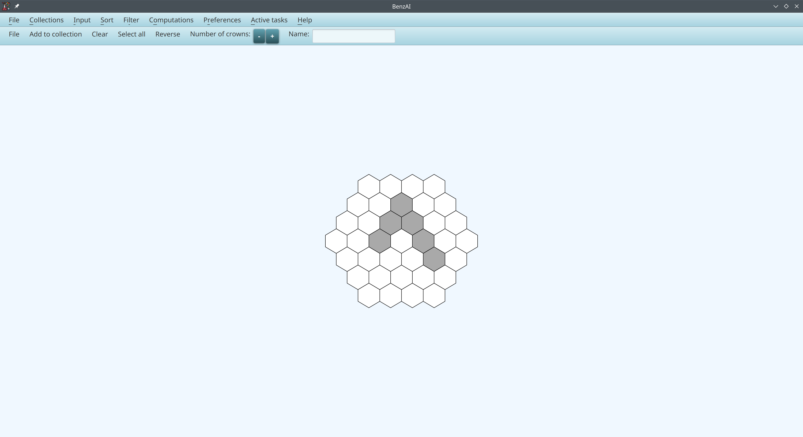

# The main features proposed by BenzAI

## Collection

A collection is a set of benzenoid structures. A collection can be defined:
* by drawing the structures one by one, 
* by importing one or several structures from files or from our database,
* by an automatic generation using constraints.

The user can define as many collections as they wishes.
Benzenoid structures can be added, deleted or moved from a collection to another at the user's convenience.

An example of a collection:

## Generation

BenzAI can exhaustively produce all the benzenoid structures satisfying all the criteria selected by the user.
Several criteria can be combined to meet their needs:
* criteria based on the chemical composition:
  * Total number of hexagons
  * Total number of carbon atoms
  * Total number of hydrogen atoms
* criteria based on the structure:
  * Irregularity parameter ξ and/or number of solo, duo, trio and quarto
  * Diameter (i.e. the longest shortest path between two hexagons in the structure) 
  * Particular shapes: Coronenoid, rectangle, rhombus, catacondensed
  * With/without holes (Coronoids)
  * Satisfying certain [symmetries](symmetries)
  * With/without a combination of patterns (e.g. deep bay, armchair edge, ...). Patterns can be joint, disjoint or share hexagons.

The collection above corresponds to the criterion "at most four hexagons".

As the number of benzenoid structures grows with the number of hexagons, the automatic generation may be time and/or space expensive. 
So BenzAI proposes some mechanisms in order to control the generation. The generation may be paused and then resumed or definitively stopped at the user's request.
Two criteria can also be added before running the generation:
* Number of solutions
* Time limit

## Drawing
A user-friendly graphical interface allows the user to draw the structures of their choice by simply clicking on hexagons:

## Database
Our database [BenzDB](https://benzenoids.lis-lab.fr/) contains all the benzenoid structures having at most nine hexagons. The user can select the desired structures by giving some criteria among:
* Id or name of the structure
* Total number of hexagons
* Total number of carbon atoms
* Total number of hydrogen atoms.

## Sorting/filtering a collection
Any collection can be filtered according to some criteria. These criteria are those of the generation (except for the number of solutions or total time) and the number of Kekulé structures. 
Filtering a collection produces a new collection.

Any collection can be sorted out in increasing or decreasing order with respect to structural parameters (number of hexagons, number of carbon atoms, number of hydrogen atoms, or irregularity) or with respect to the 
number of Kekulé structures.

By sorting the first collection according to the increasing number of hexagons, we obtain the following collection.

## Import/export benzenoid structures
The user can import a benzenoid structure or a collection from their computer. The file containing a benzenoid structure must be in [graph format](graph_format). 
Importing a collection consists simply in selecting several files (these files must be located in the same directory).

Benzenoid structures can be exported to the following format:
* [graph format](graph_format)
* CML format (Chemical Markup Language)
* XYZ format
* PNG format (Portable Network Graphics)

## Analyzing electronic structures
To analyze the electronic structure of benzenoids, one of the following methods can be exploited:
* Resonance energy: Two computations are available. The first one relies on Lin's algorithm while the second one is based on Lin and Fan's algorithm. 
The latter may be time expensive since it requires to enumerate all the Kekulé structures. As both algorithms obtain similar results, we recommend users to exploit the first algorithm.
* Clar cover
* Ring bond order

Each method can be applied on a selection of structures or to a whole collection. In both cases, a new collection containing the results is created.

For instance, here is the result of the resonance energy computation on the considered collection:

## Providing infrared spectra
Our database stores the infrared spectra (computed at the 6-31G/B3LYP level of theory) for all the benzenoid structures having at most nine hexagons.
An example of spectra for the structure of the collection having 14 carbon atoms.

