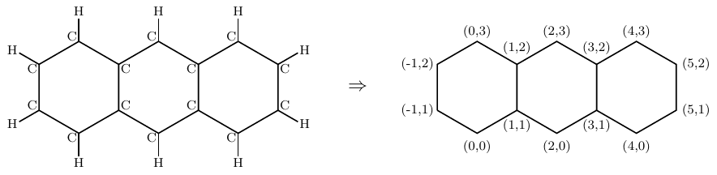

# The graph file format

The graph format aims to represent each benzenoid structure as a graph whose vertices correspond to its carbon atoms and an edge links two vertices if there is a bond between the two associated carbon atoms.
It is a text format inspired from the [DIMACS](http://archive.dimacs.rutgers.edu/Challenges) format used to express graphs. We enrich the DIMACS format to deal with the hexagons formed by the carbon atoms, but also handle the coordinates of each carbon atom.
We can note that the hydrogen atoms are not represented in such graphs because they can be easily deduced from the existing bonds.
More precisely, each carbon that establishes only bonds with two carbon atoms shares a bond with a hydrogen atom.

## Format description
Each line starts with a letter (in lower case) which specifies the kind of this line.
* Line starting with the letter p: Only one such line is allowed and it must precede the others. This line provides the main features of the benzenoid. 
  It contains the DIMACS label followed by three integers. The first integer is the number of carbon atoms, the second the number of bonds and the third the number of hexagons.
* Lines starting with the letter e: Such a line defines an edge of the graph (i.e. a bond between two carbon atoms). 
  It then contains two values of the form x_y that specify the two carbons atoms establishing the corresponding bond.
  The vertex x_y means that the vertex is located at the coordinate (x,y) in a Cartesian coordinate system.
* Lines starting with the letter h: Such a line defines a hexagon. It contains the list of the six vertices that form the hexagon. 
  This list starts with the carbon atom located at the bottom of the hexagon and is given in counter-clockwise order.

For example, here is the graph describing anthracene:

and the corresponding file:

      p DIMACS 14 16 3
      e 0_0 1_1
      e 0_0 -1_1
      e 1_1 1_2
      e 1_1 2_0
      e -1_1 -1_2
      e 1_2 0_3
      e 1_2 2_3
      e 2_0 3_1
      e 0_3 -1_2
      e 2_3 3_2
      e 3_1 3_2
      e 3_1 4_0
      e 3_2 4_3
      e 4_0 5_1
      e 4_3 5_2
      e 5_1 5_2
      h 0_0 1_1 1_2 0_3 -1_2 -1_1 
      h 2_0 3_1 3_2 2_3 1_2 1_1 
      h 4_0 5_1 5_2 4_3 3_2 3_1 
