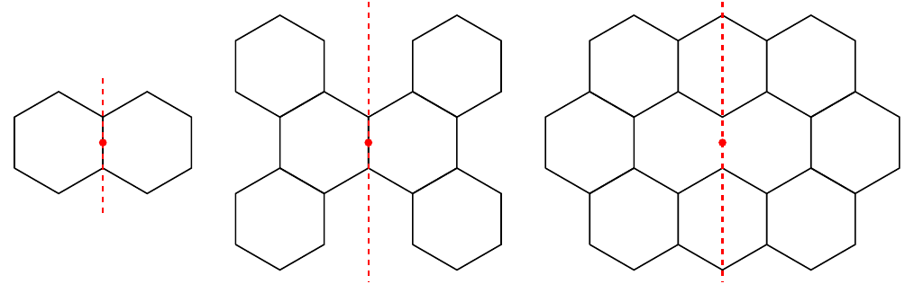

# An illustration of the symmetries used in BenzAI

In BenzAI, 13 symmetries can be used as a criterion when generating or filtering structures. For each of them, we give its name from both a chemical and a graphical viewpoint, its definition and some
examples to illustrate it. Symmetry can be related to a rotational center and/or a mirror axis. In this context, we consider a particular point: the center of the benzenoid structure.
This point is also known as the geometric center or the barycenter and is a fixed point whatever the symmetry we consider.

For rotational symmetries, the rotational center is the center of the benzenoid structure. One can distinguish three cases:
* the center is the center of a (possible[^1]) hexagon (i.e. a face of the graph of carbon atoms),
* the center corresponds to the location of a (possible[^1]) carbon atom (i.e. a vertex of the graph),
* the center corresponds to the location of a (possible[^1]) bond between two carbon atoms (i.e. an edge of the graph).

Regarding the mirror axis, the axis necessarily passes through the center of the benzenoid structure.
Moreover, there exist two cases:
* The axis passes through some carbon atoms and is parallel to some edges,
* The axis does not pass through any carbon atoms and is perpendicular to some edges.

In the following examples, the rotational center and/or the mirror axis to which each symmetry is related are depicted in red.

## C_2v(a) or face-mirror
This symmetry is based on an axis that does not pass through any carbon atoms.

## C_6h or face-60°-rotation
This symmetry is based on 60°-rotation (the center of the benzenoid structure being necessarily a (possible) hexagon).

## C_3h(i) or face-120°-rotation
This symmetry is based on 120°-rotation (the center of the benzenoid structure being a (possible) hexagon).  

## C_2h(i) or vertex_180°-rotation
This symmetry is based on 180°-rotation (the center of the benzenoid structure being a (possible) hexagon).  

## C_2v(b) or edge-mirror
This symmetry is based on an axis that passes through some carbon atoms.

## C_3h(ii) or vertex-120°-rotation

This symmetry is based on 120°-rotation (the center of the benzenoid structure being a (possible) carbon atom).

## C_2h(ii) or edge-180°-rotation
This symmetry is based on 180°-rotation (the center of the benzenoid structure being a (possible) bond).

## D_6h or vertex-60°-rotation+edge-mirror
This symmetry is a combination of C_6h and C_2v(b).

## D_3h(ii) or vertex-120°-rotation+edge-mirror
This symmetry is a combination of C_3hii and C_2v(b).

## D_3h(ia) or face-120°-rotation+face-mirror
This symmetry is a combination of C_3hi and C_2v(a).

## D_3h(ib) or face-120°-rotation+edge-mirror
This symmetry is a combination of C_3hi and C_2v(b).

## D_2h(ii) or edge-180°-rotation+edge-mirror
This symmetry is a combination of C_2h(ii) and C_2v(b).

## D_2h(i) or face-180°-rotation+edge-mirror
This symmetry is a combination of C_2hi and C_2v(b).

[^1]: In BenzAI, we consider a hexagon tiling on which we represent benzenoid structures. By so doing, the center of the benzenoid structure is always located in a hexagon (inside or on its edge) of the tiling. Most of the time this hexagon is part of the considered benzenoid structure. However, for some benzenoid structures (e.g. coronoids), it is not the case. Hence, we speak of a possible hexagon in the sense that the hexagon is part of the hexagon tiling but not necessarily of the considered benzenoid structure. By extension, we also speak of a possible carbon atom or a possible bond for dealing with a carbon atom or a bond of a possible hexagon.
