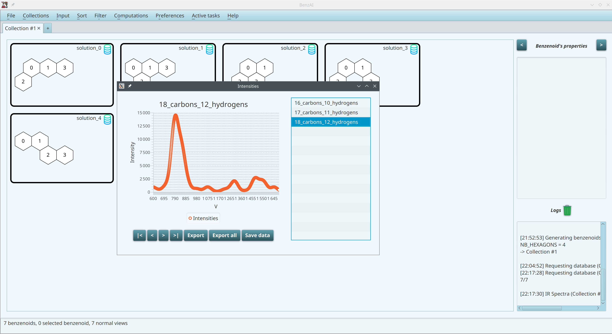

# Some use cases of BenzAI

We describe, step by step, several use cases that we use to produce some figures of our article "BenzAI: A Program to Design Benzenoids with Defined Properties Using Constraint Programming" published in JCIM.

## A basic generation of the benzenoids having six hexagons and a mirror symmetry (Figure 1)

The first use case deals with the generation of the first four benzenoids having six hexagons and a mirror symmetry.

First, we go to the menu Input and choose the entry Generator.

We impose as the first criterion that the number of hexagons is equal to six. Then we define a second criterion related to the symmetry and a third one in order to limit the number of solutions to four.

Finally, we run the generation and obtain the first four desired benzenoids (among eleven).

## A generation of the benzenoids having seven hexagons and contains two patterns (Figure 2)

The second use case is related to generation of benzenoids with seven hexagons, made of all possible combinations of two given patterns. 

We first impose that the number of hexagons is equal to seven.

Then we add a criterion related to the first considered pattern.

We draw the first pattern and specify that it must be present in any solution.
For patterns, green hexagons indicate that the hexagons must be present in the solution, whereas red hexagons must not be in the solution and represent the vacuum.

We do the same for the second pattern.

We are now ready to run the generation

We run the generation and obtain 213 desired benzenoids from which five have been selected to form Figure 2.

## A generation based on the number of carbon atoms (Figure 4)

In this third use case, we are interested in generating all the benzenoid structures having 32 carbon atoms with a ξ value of 1.

We first impose that the number of carbon atoms is equal to 32.

We add the criterion about the irregularity.

We run the generation and obtain a single desired benzenoid.

Another possibility is to first generate all benzenoids with 32 carbon atoms.

We are now ready to run the generation and obtain 330 benzenoid structures.

Now, we sort the benzenoids by decreasing ξ value and the desired benzenoid is the first one.

Here is the result of the sorting:

The first solution is the best one since we only generate the desired structured (remember that the number of benzenoids may become huge).

## Vibrational spectra (Figure 5)

In this fourth use case, we are interested in the vibrational spectra for the benzenoids with four hexagons. First, we generate a collection containing all the benzenoids with four hexagons.

Here is the result:

We select all the benzenoids.

We go to the menu Computations and select the entry IR spectra.

Another possibility is to use the right click and select the entry IR spectra.

In both cases, we obtain the desired spectra by downloading the required data from our database.
Three spectra are obtained as these benzenoids can have either 16, 17, or 18 carbon atoms. 
The spectrum for the benzenoids having 16 carbon atoms:

The spectrum for the benzenoids having 17 carbon atoms:

The spectrum for the benzenoids having 18 carbon atoms:

